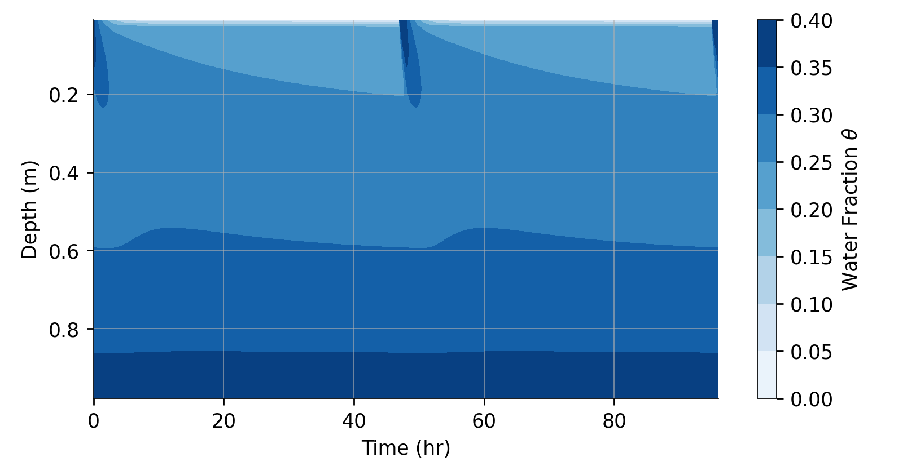

# Richards

This repository contains a one-dimensional model of [the Richards equation](https://en.wikipedia.org/wiki/Richards_equation), which represents the movement of water in unsaturated soil. For more background about the equations and physical parameters in the model, see
* [Margulis, S. "Introduction To Hydrology." Used as textbook in C&EE 150 (2014).](https://margulis-group.github.io/teaching/)

The model simulates a section of partially saturated soil with a fully saturated boundary at the bottom and a top boundary that alternates between fully saturated and dry, with user-specified durations for each. This alternation represents cycles of wetting and drying, to understand how much water penetrates from the surface to deeper soil with different cycle characteristics and physical parameters.

The model is written in C++ and it depends on an external library of ODE solvers, [`libode`](https://github.com/wordsworthgroup/libode). That library must be downloaded and compiled before the Richards model can be compiled.

For more details, see the [documentation](https://github.com/wordsworthgroup/richards).

