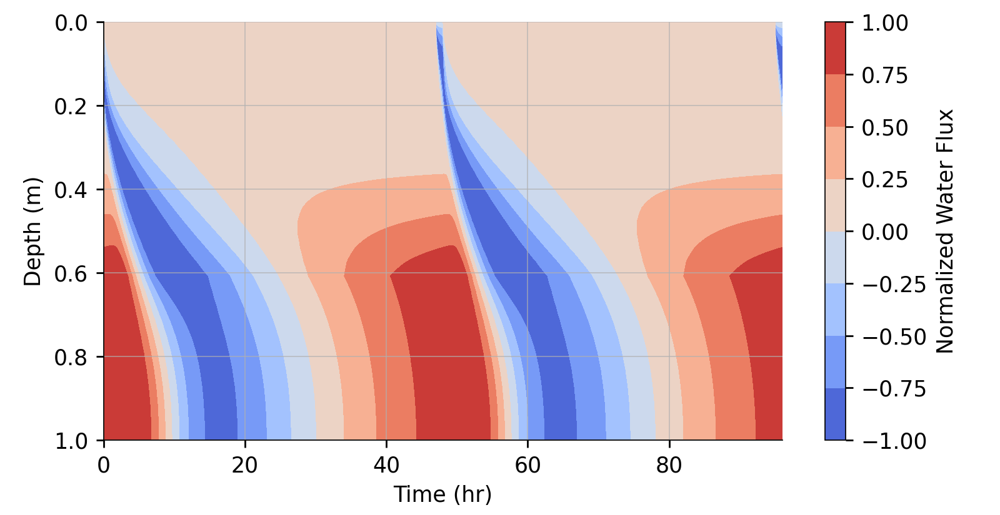
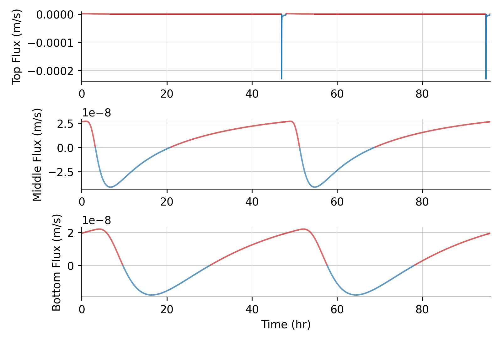

# Richards

This repository contains a one-dimensional model of [the Richards equation](https://en.wikipedia.org/wiki/Richards_equation), which represents the movement of water in unsaturated soil. For more background about the equations and physical parameters in the model, see Chapter 7, Section 4 of:
* [Margulis, S. "Introduction To Hydrology." Used as textbook in C&EE 150 (2014).](https://margulis-group.github.io/teaching/)

The model simulates a section of partially saturated soil with a fully saturated boundary at the bottom and a top boundary that alternates between fully saturated and dry. The duration of wet and dry surface periods are user-specified. This alternation represents cycles of wetting and drying, to understand how much water penetrates from the surface to deeper in the soil column with different cycle characteristics and physical parameters.

The model is written in C++ and it depends on an external library of ODE solvers, [`libode`](https://github.com/wordsworthgroup/libode). That library must be downloaded and compiled before the Richards model can be compiled.

For more details, see the [documentation](https://wordsworthgroup.github.io/Richards/).

---------------------------------------------------

The plots below show an example simulation with a model domain 1 meter deep. Every 2 days, the top boundary is completely wet for one hour, as if it were raining hard. After the one hour wet period, moisture is allowed to evaporate from the surface. The bottom boundary is always fully saturated, as if it were the water table.

These plots can be generated, after compiling the model, with:
```shell
python clean.py out
./bin/richards_periodic.exe settings.txt out
cd scripts
python plot_period.py
cd ..
```

The first plot is like a [Hovmöller diagram](https://en.wikipedia.org/wiki/Hovm%C3%B6ller_diagram). It shows water flux throughout the model depth and across two wetting cycles. Red indicates upward flux and blue indicates downward flux. Every 2 days, the top of the diagram turns blue for about an hour when the surface is wet. The surface dries relatively quickly and moisture moves down the model domain, eventually causing a downward flux at the bottom boundary. The bottom boundary, however, switches between downward and upward flow, however. It's not clear from this plot whether, on average, more water is being removed from the bottom boundary that it is gaining.



This second plot simply shows the saturation fraction in the model domain, using the same Hovmöller style as above. The wet period at the top of the model is clear again.



This third plot shows the fluxes at the top, middle, and bottom of the model over time. At the top, the wet period manifests as a massive spike in downward (blue) water flux separated by much slower upward (red) flux as water evaporates from the soil into the atmosphere. In the middle of the domain, the wetting and drying cycles are smoothed out and slightly delayed. At the bottom, the cycle is even smoother and delayed. In this example, the bottom boundary is, on average, losing water. You can prove it by integrating the flux curve over time at any depth.


